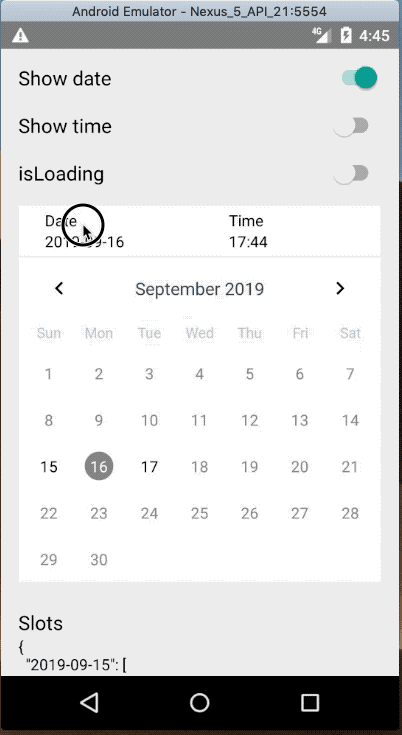

What is it
----------

React-Native implementation of time schedule.



Example
-------
You can specify and show your own table schedule by passing `slots` object-map to `ScheduleView`.

```js
import { ScheduleView, DayKey, Slot } from 'react-native-library'

<ScheduleView
  slots={{
    '2019-12-31': [{
      time: new Date().setMinutes(0),
      enabled: true
    }, {
      time: new Date().setMinutes(30),
      enabled: true
    }]
  }}
  showDate={false} // show date selector
  showTime={true} // show time slot selector
  onDateChanges={(date?: DayKey, slot?: Slot) => {
    this.setState({
      date: date, // selected date
      slot: slot, // selected time slot
    })
  }}
  // optional params below
  isLoading={false}
  renderArrow={(direction: 'left' | 'right') => <MyArrowView direction={direction} />}
  renderDay={dayProps => {
    const { enabled, selected, today, dateObject } = dayProps
    const { day, month, year, dateString } = dateObject
    return <MyDayView {...dayProps} />
  }}
  renderTime={slotProps => {
    const { slot, enabled, selected, formatter } = slotProps
    return <MyTimeSlotView {...slotProps} text={formatter(slot)} />
  }}
  formatDate={(date: DayKey) => date}
  onMonthChanges={(year: number, month: number) => console.log(`${year} ${month}`)}
/>
```

If you have any question or problem, feel free to open an issue.

---

```
The MIT License

Copyright (c) 2010-2019 Lamantin Group, LTD. https://lamantin.group

Permission is hereby granted, free of charge, to any person obtaining a copy
of this software and associated documentation files (the "Software"), to deal
in the Software without restriction, including without limitation the rights
to use, copy, modify, merge, publish, distribute, sublicense, and/or sell
copies of the Software, and to permit persons to whom the Software is
furnished to do so, subject to the following conditions:

The above copyright notice and this permission notice shall be included in
all copies or substantial portions of the Software.

THE SOFTWARE IS PROVIDED "AS IS", WITHOUT WARRANTY OF ANY KIND, EXPRESS OR
IMPLIED, INCLUDING BUT NOT LIMITED TO THE WARRANTIES OF MERCHANTABILITY,
FITNESS FOR A PARTICULAR PURPOSE AND NONINFRINGEMENT. IN NO EVENT SHALL THE
AUTHORS OR COPYRIGHT HOLDERS BE LIABLE FOR ANY CLAIM, DAMAGES OR OTHER
LIABILITY, WHETHER IN AN ACTION OF CONTRACT, TORT OR OTHERWISE, ARISING FROM,
OUT OF OR IN CONNECTION WITH THE SOFTWARE OR THE USE OR OTHER DEALINGS IN
THE SOFTWARE.
```